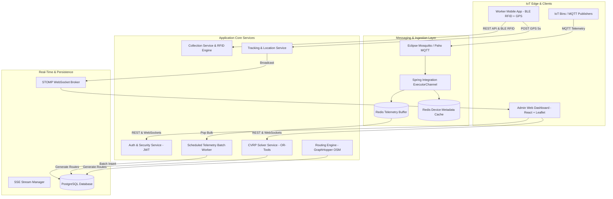

# EcoMonitor Backend — Smart IoT Waste Management & Logistics Platform

[](https://www.oracle.com/java/)
[](https://spring.io/projects/spring-boot)
[](https://www.postgresql.org/)
[](https://redis.io/)
[](https://mqtt.org/)
[](https://spring.io/guides/gs/messaging-stomp-websocket/)
[](http://localhost:8000/swagger-ui.html)
[](https://www.docker.com/)

**EcoMonitor** is an enterprise-grade, high-concurrency backend system designed for smart municipal waste management and real-time fleet logistics. It combines **IoT telemetry ingestion**, algorithmic **Capacitated Vehicle Routing Problem (CVRP)** optimization, **Bluetooth Low Energy (BLE) RFID bin verification**, **STOMP WebSockets live tracking**, and **government-grade audit logging**.

---

## 🌟 Key Features & Architectural Highlights

### 1. High-Concurrency IoT Telemetry Ingestion (MQTT + Redis)
- **Non-blocking Pipeline**: Ingests continuous telemetry updates from smart bins using Spring Integration MQTT (`Eclipse Paho`).
- **Redis Cache-Aside & Write-Buffering**: Caches device metadata in Redis to avoid per-message database lookups. Pushes incoming telemetry readings to an in-memory Redis list queue (`telemetry:buffer`).
- **Scheduled Batch Ingestion**: A background worker pops buffered sensor readings every 1–2 seconds and performs bulk writes to PostgreSQL using **JDBC Batch Updates**, eliminating database connection pool starvation under heavy IoT traffic.

### 2. Algorithmic Route Optimization (CVRP Solver)
- **Smart Routing Engine**: Solves the Capacitated Vehicle Routing Problem (CVRP) using **Google OR-Tools** and **GraphHopper OSM Routing Engine** (with a fallback to Haversine routing).
- **Dynamic Route Generation**: Analyzes real-time bin fill levels (> threshold) and vehicle weight capacities to compute the shortest, most cost-effective collection routes with polyline map overlays.

### 3. Real-Time Tracking & Telemetry Broadcasting
- **STOMP WebSockets**: Broadcasts vehicle GPS location updates every 5 seconds to subscribers on `/topic/tracking/{routeId}`.
- **SSE Emitters**: Supports Server-Sent Events (SSE) streaming for live sensor updates directly to frontend clients.

### 4. BLE RFID Hardware Verification & Government Audit Logging
- **Hardware Bin Verification**: Integrates with physical ESP32 + MFRC522 BLE RFID handheld scanners to match scanned bin RFID tags against registered hardware IDs.
- **Immutable Audit Trail**: Logs every worker action (`ROUTE_STARTED`, `ARRIVED`, `RFID_SCANNED`, `COLLECTED`, `SKIPPED`, `ROUTE_COMPLETED`) into a dedicated `COLLECTION_LOGS` table for compliance and auditability.

### 5. Multi-Tenant Role-Based Access Control (RBAC) & Security
- **JWT Authentication**: Stateless authentication with JWT token generation and header verification.
- **Granular RBAC**: Enforces per-interface permissions across `OWNER`, `ADMIN`, and `USER` roles.
- **Password Security**: Uses BCrypt password hashing (strength 12) and supports OTP email verification via Spring Mail.

---

## 🏗️ System Architecture



---

## 🛠️ Technology Stack

| Domain | Technology | Purpose |
| :--- | :--- | :--- |
| **Language & Runtime** | Java 21 (JDK 21) | Core application runtime |
| **Framework** | Spring Boot 3.4.3 | Application core, Web MVC, Security |
| **Database** | PostgreSQL 15 | Primary relational data store |
| **Cache & Queue** | Redis (Spring Data Redis) | Metadata caching & telemetry write-buffering |
| **IoT Protocols** | Eclipse Paho MQTT, Spring Integration | Hardware telemetry ingestion |
| **Real-Time Communication** | STOMP WebSockets, SockJS, SSE | Live tracking & telemetry streams |
| **Routing & Optimization** | GraphHopper 9.0, Google OR-Tools | CVRP route generation & OSM routing |
| **Security** | Spring Security, JJWT (0.12.3) | JWT stateless auth & BCrypt hashing |
| **API Documentation** | Springdoc OpenAPI 2.8.8 (Swagger UI) | Interactive REST API documentation |
| **Build & Containerization** | Maven Wrapper, Docker, Docker Compose | Build automation and deployment |

---

## 🚀 API Documentation & Swagger UI

The backend includes full OpenAPI 3 annotations. When the application is running, you can access the interactive Swagger UI at:

👉 **[http://localhost:8000/swagger-ui.html](http://localhost:8000/swagger-ui.html)**

### Key Endpoint Groups

| Module | Base Path | Endpoints & Key Actions |
| :--- | :--- | :--- |
| **Auth** | `/api/auth` | User registration, OTP verification, login, password reset, Google OAuth2 |
| **User** | `/api/users` | Profile view (`/me`), user search by prefix (`/search`), health check (`/hello`) |
| **Interface** | `/api/interface` | Multi-tenant interface CRUD and device group associations |
| **Access** | `/api/interface/{id}` | Grant, list, and revoke user roles (`OWNER`, `ADMIN`, `USER`) |
| **Device** | `/api/device` | Device registration, hardware linking, reading queries, SSE stream |
| **Route** | `/api/routes` | CVRP route optimization (`/optimize`), route retrieval, interface route queries |
| **Collection** | `/api/routes/{id}` | Worker assignment, route start/complete, stop collection with RFID verification, audit logs |
| **Tracking** | `/api/tracking` | Worker GPS location submission (`/location`) and route GPS trail lookup |
| **Vehicle** | `/api/vehicles` | Fleet management, vehicle creation, driver assignment, status updates |

---

## 📂 Project Structure

```
d:/Projects/ecomonitor-backend/src/main/java/com/example/demo/
├── config/             # Spring Security, MQTT, WebSocket & CORS configurations
├── controller/         # REST Controllers (Auth, Collection, Device, Route, Tracking, Vehicle, User, Access)
├── exceptions/         # Global Exception Handler and custom exception classes
├── filter/             # JWT Authentication Filter
├── model/              # JPA Entities (Route, RouteStop, Device, Vehicle, CollectionLog, User, etc.)
│   ├── Dtos/           # Request/Response Data Transfer Objects grouped by feature
│   └── enums/          # Status & Role enumerations (RouteStatus, DeviceStatus, Role)
├── repo/               # Spring Data JPA Repositories
├── service/            # Core Business Logic (RouteService, CvrpSolverService, CollectionService, TrackingService, RedisService, etc.)
└── utils/              # SSE Stream Manager, Device Stream Emitters, JwtUtil, ScheduledTaskManager
```

---

## ⚡ Getting Started

### Prerequisites
- **Java 21** or higher
- **Maven 3.8+** (or use included `mvnw` wrapper)
- **Docker & Docker Compose** (optional for containerized environment)
- **PostgreSQL & Redis** instances (or launch via Docker Compose)

### Running Locally (Native)

1. **Clone the repository:**
   ```sh
   git clone https://github.com/ayushman1626/ecomonitor-backend.git
   cd ecomonitor-backend
   ```

2. **Configure Database & Redis Credentials:**
   Ensure PostgreSQL and Redis are running locally, or update `src/main/resources/application.properties` with your environment configuration.

3. **Build and run using Maven Wrapper:**
   ```sh
   ./mvnw clean compile
   ./mvnw spring-boot:run
   ```

4. **Verify Application:**
   Open `http://localhost:8000/swagger-ui.html` in your browser.

---

### Running with Docker Compose

1. **Start all services (Backend, PostgreSQL, Redis):**
   ```sh
   docker compose up --build
   ```

2. **Check Container Status:**
   ```sh
   docker compose ps
   ```

3. **Stop Application:**
   ```sh
   docker compose down
   ```

---

## 📜 License & Author

Developed by **Ayushman** as part of the **EcoMonitor** Smart City Infrastructure Platform.
