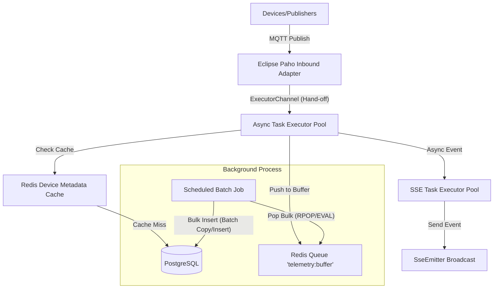

# Scalability and Concurrency Optimization Plan (with Redis Integration)

This document outlines the high-level system architecture and implementation plan to transition the EcoMonitor backend from a synchronous, single-threaded ingestion pipeline to a highly concurrent, scalable architecture using **Redis** to cache device lookups and buffer incoming telemetry writes.

---

## Proposed Architecture Topology

---

## Proposed Changes

### Component 1: Docker Infrastructure
Add Redis to the Docker Compose config.

#### [MODIFY] [compose.yaml](file:///d:/Projects/ecomonitor-backend/compose.yaml)
- Add a standard `redis:alpine` container definition.

---

### Component 2: Dependencies and Configuration

#### [MODIFY] [pom.xml](file:///d:/Projects/ecomonitor-backend/pom.xml)
- Add `spring-boot-starter-data-redis` dependency.

#### [MODIFY] [application.properties](file:///d:/Projects/ecomonitor-backend/src/main/resources/application.properties)
- Add Redis configuration connection details:
  - `spring.data.redis.host=${REDIS_HOST:localhost}`
  - `spring.data.redis.port=${REDIS_PORT:6379}`

---

### Component 3: Asynchronous MQTT Ingestion Channel

#### [MODIFY] [MqttConfig.java](file:///d:/Projects/ecomonitor-backend/src/main/java/com/example/demo/config/MqttConfig.java)
- Replace `DirectChannel` with an `ExecutorChannel` backed by a `ThreadPoolTaskExecutor` to instantly hand off processing from the Eclipse Paho thread.

---

### Component 4: Redis Cache & In-Memory Queue Buffer for Writes

#### [NEW] [RedisService.java](file:///d:/Projects/ecomonitor-backend/src/main/java/com/example/demo/service/RedisService.java)
- Implement caching layer for device metadata.
- Implement queueing methods (`lPush`, `rPopBatch` or similar) to buffer incoming sensor data.

#### [MODIFY] [MqttService.java](file:///d:/Projects/ecomonitor-backend/src/main/java/com/example/demo/service/MqttService.java)
- Query device details from Redis (cache-aside pattern).
- Instead of executing direct database inserts/updates per request, push raw sensor events to Redis.

#### [NEW] [TelemetryBatchWorker.java](file:///d:/Projects/ecomonitor-backend/src/main/java/com/example/demo/service/TelemetryBatchWorker.java)
- A `@Scheduled` task that runs every 1-2 seconds, pops batches from Redis, and writes them to PostgreSQL using JDBC Template Batch updates.

---

### Component 5: Asynchronous SSE Emitter Broadcasts

#### [MODIFY] [DeviceStreamManager.java](file:///d:/Projects/ecomonitor-backend/src/main/java/com/example/demo/utils/DeviceStreamManager.java)
- Use a thread pool to broadcast updates asynchronously so slow web client connections do not bottleneck ingestion.

---

## Verification Plan

### Automated Load Testing
1. **MQTT Load Simulator:**
   - Create a lightweight Python script using `paho-mqtt` that spawns 5,000 virtual clients publishing data every 10 seconds.
2. **Performance Metrics Checklist:**
   - Confirm backend CPU usage remains stable (< 80%).
   - Verify Hikari database connection pool statistics show zero timeout exceptions.
   - Confirm telemetry data count matches simulator expectations in Postgres.
