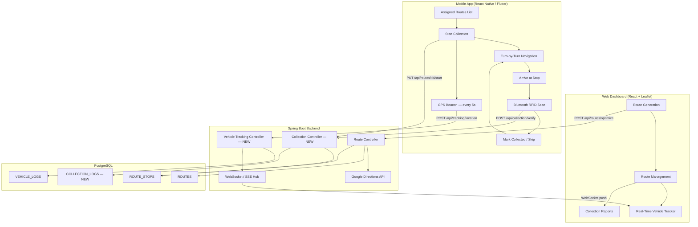
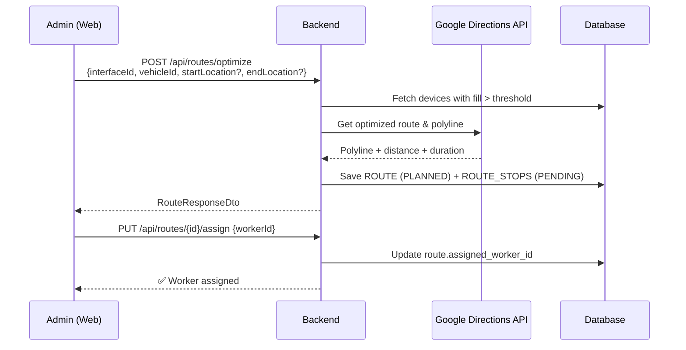
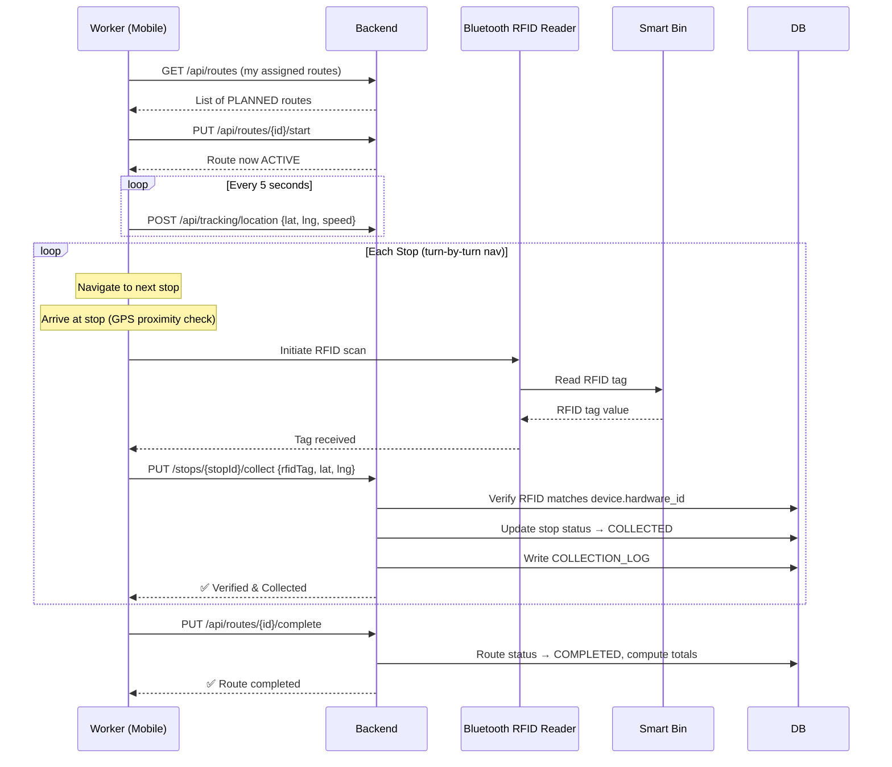
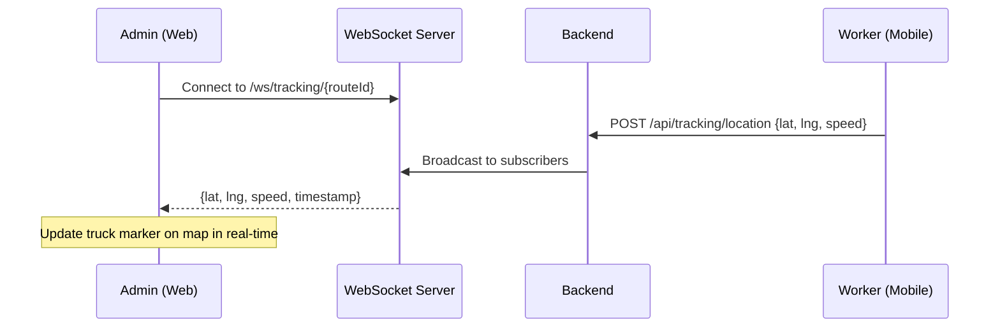

# EcoMonitor — Route Collection System Architecture

## System Overview

A **government-grade smart waste collection system** where **Admins** generate optimized collection routes from the web dashboard, and **Workers** execute those routes via a mobile app with real-time navigation, Bluetooth RFID scanning, and live GPS tracking.

---

## Actors & Roles

| Actor | Platform | Capabilities |
|-------|----------|-------------|
| **Admin** | Web Dashboard | Generate routes, assign workers, track vehicles in real-time, view collection reports |
| **Worker** | Mobile App (Android) | View assigned routes, start collection, navigate turn-by-turn, scan RFID via Bluetooth, mark stops as collected/skipped |
| **System** | Backend | Optimize route via Google Directions API, store GPS logs, push real-time updates via WebSocket |

---

## High-Level Architecture



---

## DB Schema — Current + Proposed Additions

Your current schema is solid. Based on the requirements, here are the **additions needed**:

### Existing Tables (from your diagram)

| Table | Key Columns | Notes |
|-------|-------------|-------|
| `ROUTES` | `id`, `interface_id`, `vehicle_id` (FK→DEVICES/Trucks), `status` (PLANNED/ACTIVE/COMPLETED), `total_dis`, `polyline`, `created_at` | ✅ Already good |
| `ROUTE_STOPS` | `id`, `route_id`, `device_id` (FK→DEVICES/Bins), `stop_order`, `status` (PENDING/COLLECTED/SKIPPED) | ✅ Already good |
| `VEHICLE_LOGS` | `id`, `device_id` (FK→DEVICES/Trucks), `latitude`, `longitude`, `speed`, `timestamp` | ✅ For GPS tracking |

### Proposed New/Modified Tables

#### `ROUTES` — Add Fields

| Column | Type | Description |
|--------|------|-------------|
| `assigned_worker_id` | UUID FK→USERS | Worker assigned to execute this route |
| `started_at` | timestamp | When the worker started collection |
| `completed_at` | timestamp | When collection was finished |
| `total_collected` | int | Count of bins actually collected |
| `total_skipped` | int | Count of bins skipped |

#### `ROUTE_STOPS` — Add Fields

| Column | Type | Description |
|--------|------|-------------|
| `collected_at` | timestamp | When the stop was marked collected |
| `rfid_tag` | string | RFID tag scanned at collection |
| `rfid_verified` | boolean | Whether RFID matched the expected bin |
| `skip_reason` | string | Reason if skipped (e.g., "Blocked", "Not accessible") |
| `worker_lat` | decimal | Worker GPS lat at time of collection |
| `worker_lng` | decimal | Worker GPS lng at time of collection |

#### `COLLECTION_LOGS` — NEW Audit Table

> [!IMPORTANT]
> Government systems need full audit trails. This table logs every collection action.

| Column | Type | Description |
|--------|------|-------------|
| `id` | SERIAL PK | |
| `route_id` | UUID FK→ROUTES | |
| `stop_id` | UUID FK→ROUTE_STOPS | |
| `worker_id` | UUID FK→USERS | |
| `action` | string | ARRIVED, RFID_SCANNED, COLLECTED, SKIPPED |
| `rfid_tag` | string | Scanned RFID value |
| `latitude` | decimal | GPS at time of action |
| `longitude` | decimal | GPS at time of action |
| `timestamp` | timestamp | Exact time of action |
| `notes` | string | Optional worker notes |

---

## API Endpoints — Full Contract

### Existing (from Swagger)

| Method | Endpoint | Purpose |
|--------|----------|---------|
| `POST` | `/api/routes/optimize` | Generate optimized route |
| `GET` | `/api/routes/{routeId}` | Get route by ID |
| `GET` | `/api/routes/interface/{interfaceId}` | List routes by interface |

### New Endpoints Needed

#### Route Lifecycle (Collection Controller)

| Method | Endpoint | Purpose | Used By |
|--------|----------|---------|---------|
| `PUT` | `/api/routes/{routeId}/assign` | Assign worker to route | Admin Web |
| `PUT` | `/api/routes/{routeId}/start` | Worker starts collection | Mobile |
| `PUT` | `/api/routes/{routeId}/complete` | Worker completes route | Mobile |
| `PUT` | `/api/routes/{routeId}/stops/{stopId}/collect` | Mark stop as collected + RFID | Mobile |
| `PUT` | `/api/routes/{routeId}/stops/{stopId}/skip` | Mark stop as skipped + reason | Mobile |

#### Vehicle Tracking

| Method | Endpoint | Purpose | Used By |
|--------|----------|---------|---------|
| `POST` | `/api/tracking/location` | Worker sends GPS position | Mobile (every 5s) |
| `WS` | `/ws/tracking/{routeId}` | Admin subscribes to live GPS updates | Admin Web |
| `GET` | `/api/tracking/route/{routeId}/logs` | Get full GPS trail for a route | Admin Web |

#### RFID Verification

| Method | Endpoint | Purpose | Used By |
|--------|----------|---------|---------|
| `POST` | `/api/collection/verify-rfid` | Verify scanned RFID matches the bin's hardware ID | Mobile |

---

## User Flows

### Flow 1 — Admin: Generate & Assign Route



### Flow 2 — Worker: Execute Collection



### Flow 3 — Admin: Real-Time Tracking



---

## Frontend Components — Web Dashboard

### What needs to be built in this React frontend:

| Component | Location | Description |
|-----------|----------|-------------|
| `routeService.ts` | `services/` | API client for all route endpoints |
| `RoutesPage.tsx` | `pages/` | List all routes with status badges, filters by interface/status |
| `RouteDetailsPage.tsx` | `pages/` | Full route view: map with polyline + numbered stops, live tracking overlay |
| `RouteGenerationModal.tsx` | `components/` | Modal wizard: select interface → vehicle ID → optional start/end → optimize |
| `LiveTrackingMap.tsx` | `components/` | Map component with WebSocket-driven truck marker + polyline + stop markers |
| `RouteStopsList.tsx` | `components/` | Ordered stop list with status badges (PENDING/COLLECTED/SKIPPED) |
| Sidebar "Routes" link | `MainLayout.tsx` | Navigation entry point |
| Route in `App.tsx` | `App.tsx` | `/routes` and `/routes/:routeId` routes |

### Admin Dashboard — Route Tracking View Concept

```
┌─ Route #A4F2 ─────────────────────────────────────────────┐
│ ┌──────────────────────────────┐  ┌─────────────────────┐ │
│ │                              │  │ Route Info           │ │
│ │   🗺️ Live Map               │  │ Vehicle: TN-01-AB-12│ │
│ │   ── polyline ──             │  │ Worker: Raju K.     │ │
│ │   📍① ② ③ ④ ⑤              │  │ Status: ACTIVE      │ │
│ │   🚛 (live truck position)  │  │ Distance: 12.5 km   │ │
│ │                              │  │ Duration: ~45 min    │ │
│ │                              │  │ Progress: 3/8 stops  │ │
│ └──────────────────────────────┘  ├─────────────────────┤ │
│                                   │ Stops               │ │
│                                   │ ✅ ① Bin-101 (85%)  │ │
│                                   │ ✅ ② Bin-204 (92%)  │ │
│                                   │ ✅ ③ Bin-307 (78%)  │ │
│                                   │ 🔵 ④ Bin-115 (88%)  │ │
│                                   │ ⬜ ⑤ Bin-420 (95%)  │ │
│                                   │ ⬜ ⑥ Bin-312 (82%)  │ │
│                                   └─────────────────────┘ │
└───────────────────────────────────────────────────────────┘
```

---

## Mobile App (Out of scope for this frontend, but important for context)

The mobile app will need:
- **Google Maps SDK** for turn-by-turn navigation
- **Bluetooth Low Energy (BLE)** library for RFID reader connectivity
- **Background GPS service** sending location every 5s
- **Geofencing** to auto-trigger "Arrive at Stop" when within ~50m radius
- **Offline support** in case of poor connectivity in some areas

---

## Technology Decisions

| Concern | Decision | Rationale |
|---------|----------|-----------|
| Real-time tracking | **WebSocket** (STOMP over SockJS) | Bi-directional, lower latency than SSE for GPS updates |
| Map library (Web) | **Leaflet** (already in use) | Consistent with existing codebase, supports polylines natively |
| Polyline decoding | **@mapbox/polyline** npm package | Decode Google Maps encoded polyline strings |
| RFID verification | Match `scanned_rfid_tag` against `device.hardware_id` | Simple but effective — the bin's hardware ID IS its RFID tag |
| Audit logging | **COLLECTION_LOGS** table | Government requirement: full traceability of every action |
| GPS tracking storage | **VEHICLE_LOGS** table (already in schema) | Time-series GPS data from trucks |

---

## Summary: What's Needed

### Backend Changes (not in this repo)
1. New `CollectionController` with route lifecycle endpoints
2. New `TrackingController` with GPS ingestion + WebSocket broadcast
3. New `COLLECTION_LOGS` entity and repository
4. Extend `ROUTES` and `ROUTE_STOPS` entities with new fields
5. WebSocket configuration (STOMP + SockJS)
6. RFID verification logic

### This Frontend (Web Dashboard)
1. `routeService.ts` — API client
2. `RoutesPage` — Route list with filters
3. `RouteDetailsPage` — Map + polyline + live tracking + stops list
4. `RouteGenerationModal` — Wizard to create routes
5. WebSocket client for live tracking
6. Sidebar + routing updates

### Mobile App (Separate project)
1. Route assignment list
2. Turn-by-turn navigation (Google Maps SDK)
3. BLE RFID scanner integration
4. Background GPS beacon
5. Collection workflow UI
